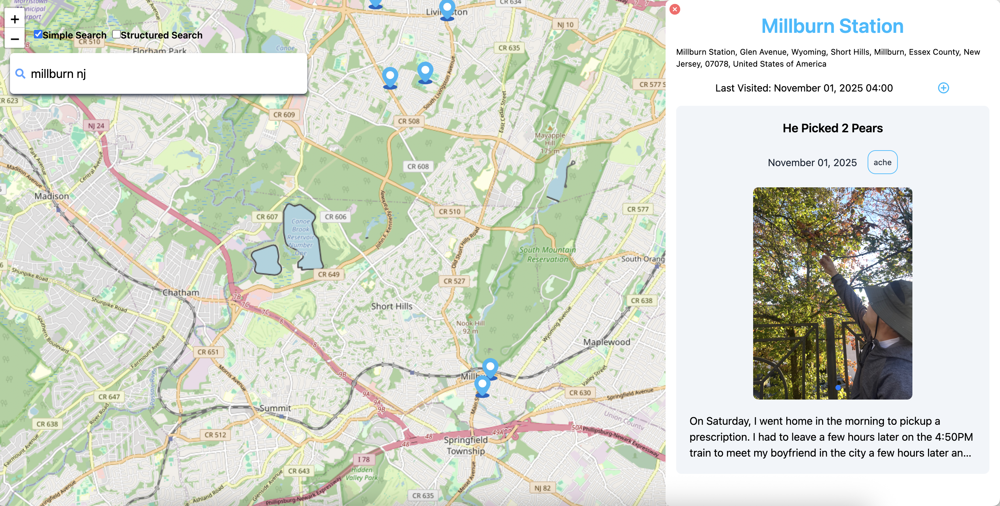
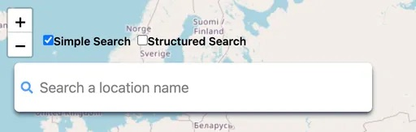
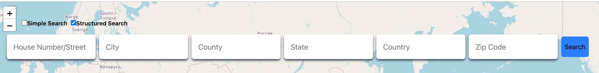
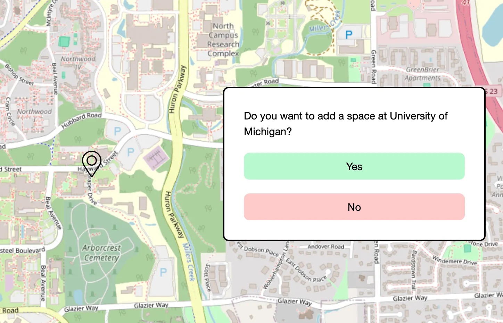
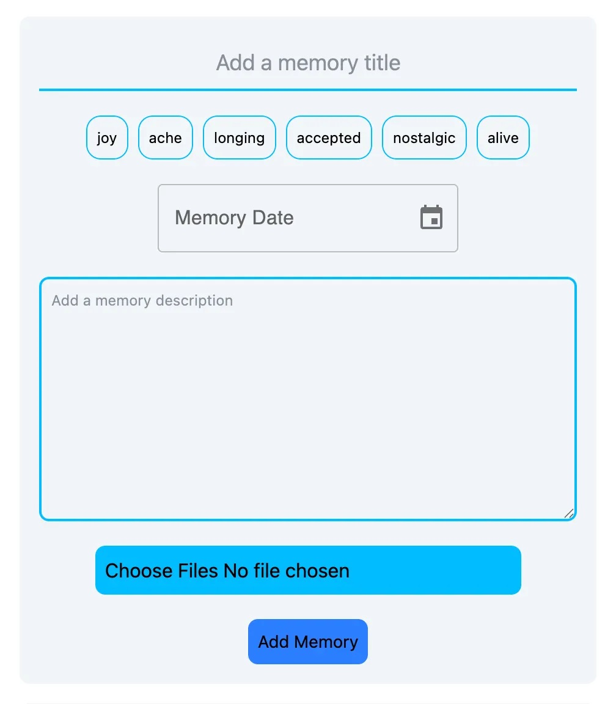
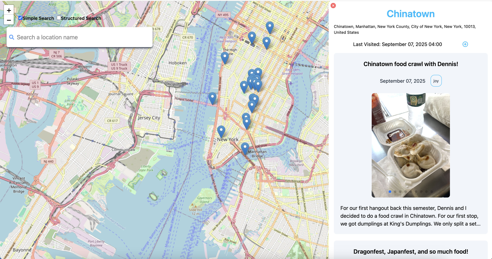

# Memory Map

## Overview
An interactive memory map of spaces. I come back to this online scrapbook whenever I want to remember how I felt in a space.
https://memory-map-frontend.onrender.com/



Technologies: React, Vite, TailwindCSS, Express, MongoDB, AXIOS

Map libraries: leaflet, react leaflet

Search API: Nominatim

Image Upload Library: Cloudinary

Date Picker Library: mui x react-date-picker

Photo Carousel Library: Swiperjs

For more, check: https://iamemilyhan.notion.site/projects-experiences

## Terminology

**Space**: A location added by the user. Represented with a visual marker on the map.

**Memory**: A memory at a space. A memory contains a title, feeling, description, and optional photos. Memories can only be added to existing spaces.

## Data Model

The application will store Spaces and Memories

* users can add multiple spaces
* each space will have store memories, where users can post memories of feeling.
* each memory will reference a space object with its _id field, linking it to a specific space

An Example Space:
```javascript
{
    display_name: "Brooklyn Bridge, FDR Drive, Two Bridges, Manhattan Community Board 3, Manhattan, New York County, City of New York, New York, 10038, United States",
    name: "Brooklyn Bridge",
    latitude: 40.7062175,
    longitude: -73.9970208,
    place_id: 332504984,
    type: "bridge",
    lastVisited: 2025-09-07T04:00:00.000+00:00,
}
```

An Example Memory:
```javascript
{
    title: "Chinatown food crawl break with dennis!!"
    feeling: "joy",
    memoryDate: 2025-09-07T04:00:00.000+00:00,
    description: "After making our first 3 food crawl stops at dumplings, roasted pork...",
    images: //An array of images
    spaceId: //Reference the _id field of its corresponding Space document
}
```

## Main Features

### Search
<sub>Components: SimpleSearch.jsx, StructuredSearch.jsx</sub>

The Search feature allows a user to locate and explore places before deciding to add them as a Space.




1. As a user, I can switch between the Simple Search Bar and the Structured Search Bar.
2. As a user, I can search up a location by the location name in the Simple Search Bar.
3. As a user, I can search up a location by the street address, county, city, state, country, and postal code in the Structured Search Bar.

### Adding a Space
<sub>Component with rendering logic: Map.jsx</sub>
<sub>Components: AddSpacePopup.jsx, AddNamePopup.jsx, ResultAddSpaceMessage.jsx</sub>



After making a search query, a user can select a search result.
- If the selected search result *already exists* as a Space, the map simply pans and centers on that existing blue marker.
- If *not*, the selected search result can optionally be added as a new Space through the **Add Space** flow.

1. As a user, I can select a search result from the search results returned by the Simple Search Bar or Structured Search Bar.
2. As a user, if my selected search result is *not already* a space, the **Add Space Popup** and a preview marker at the selected search result’s location will be rendered. I can add a space by clicking the “Yes” option of the Add Space Popup. 
    1. If my selected search result has a non-empty name field, a blue marker will instantly be rendered on the map with a success message.
    2. If my selected search result has an *empty name field*(returned from Nominatim API), an **Add Name Popup** will be rendered. After inputting a valid name and clicking submit, a blue marker will be rendered on the map with a success message.

- [Add Space from Simple Search Demo](https://www.canva.com/design/DAGyu-NlFi8/b-bKxbWHlP6qjdC2W1bpMQ/watch?utm_content=DAGyu-NlFi8&utm_campaign=designshare&utm_medium=link2&utm_source=uniquelinks&utlId=h8246ff9268)
- [Add Space, No Name Demo](https://www.canva.com/design/DAGyu2aLavM/mVKFq_kH27fu5gCrr5SSiQ/watch?utm_content=DAGyu2aLavM&utm_campaign=designshare&utm_medium=link2&utm_source=uniquelinks&utlId=h30999254a3)
- [Searching an Existing Space Demo](https://www.canva.com/design/DAGyu_gaCX4/_gq8P24SrZmIk9rl-e2_MQ/watch?utm_content=DAGyu_gaCX4&utm_campaign=designshare&utm_medium=link2&utm_source=uniquelinks&utlId=h13b523cb46)

### Adding a Memory
<sub>Component with rendering AddMemory Form logic: Map.jsx</sub>



A user can select a marker on the map(space), and the **Space Popup** will be rendered. Any existing memories will be rendered inside the Space Popup, along with other space details(date of most recent memory, name, street address).

1. As a user, I can click the “+” icon in the **Space Popup**, and the **Add Memory Form** will be rendered. I can add a new memory by filling in the required title, feeling, description, and date fields along with uploading any optional images.

[Add a Memory Demo](https://www.canva.com/design/DAGyvanFbWM/oPS9a-cBF_dG8FZsXcQuNA/watch?utm_content=DAGyvanFbWM&utm_campaign=designshare&utm_medium=link2&utm_source=uniquelinks&utlId=hed944854da)

### Space Popup
<sub>Component with rendering SpacePopup logic: Map.jsx</sub>
<sub>Component with memories UI: Memories.jsx</sub>



A user can select a marker on the map(space), and the Space Popup will be rendered. Any existing memories will be rendered inside the Space Popup, along with other space details(date of most recent memory, name, street address).

1. As a user, I can click on a Memory in the **Space Popup**, and this will become the *active memory* as long as there is no other active memory. The *active* memory will expand to display the full description and a “zoom out” exit memory button will also appear at the top left corner of the *active* memory.
2. As a user, I can exit the *active memory* by clicking on the “zoom out” exit memory button on the top left corner, and the memory will compress to 3 description lines again.

[Selecting a Space and Active Memory Demo](https://www.canva.com/design/DAG4PubDwAQ/6h2BTu_v2Pv4qIpaKf8ntg/watch?utm_content=DAG4PubDwAQ&utm_campaign=designshare&utm_medium=link2&utm_source=uniquelinks&utlId=hc440d65c0c)

